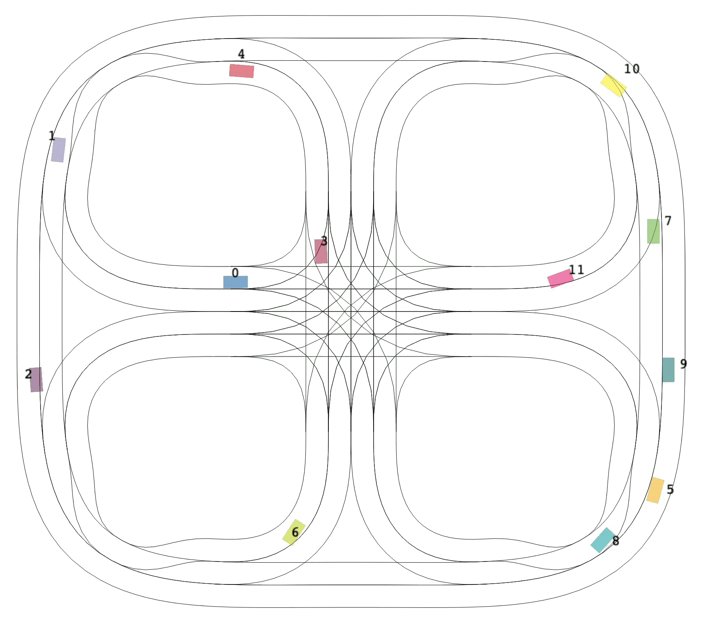
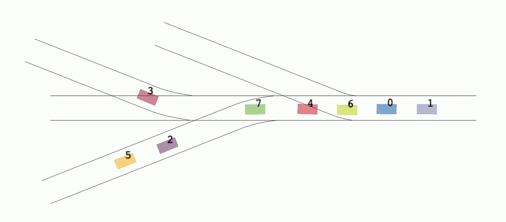
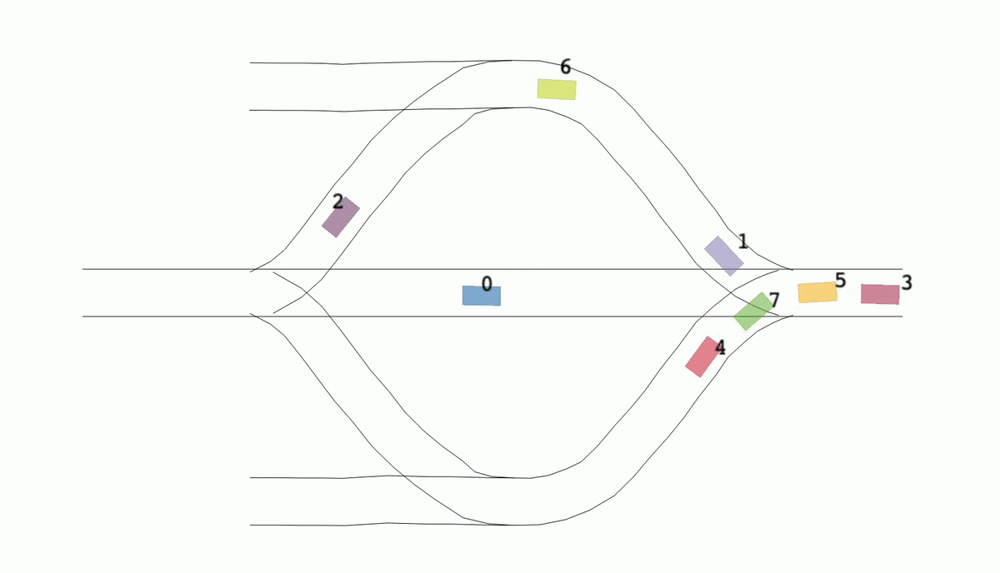

# SigmaRL: A Sample-Efficient and Generalizable Multi-Agent Reinforcement Learning Framework for Motion Planning
<!-- icons from https://simpleicons.org/ -->
<a href="https://doi.org/10.48550/arXiv.2408.07644" target="_blank"></a>
<a href="https://youtu.be/tzaVjol4nhA" target="_blank"></a>
<a href="https://github.com/cas-lab-munich/SigmaRL" target="_blank"></a>

This repository provides the full code for **SigmaRL**, a <ins>S</ins>ample eff<ins>i</ins>ciency and <ins>g</ins>eneralization <ins>m</ins>ulti-<ins>a</ins>gent <ins>R</ins>einforcement <ins>L</ins>earning (RL) for motion planning of connected and automated vehicles. This work was accepted by the 27th IEEE International Conference on Intelligent Transportation Systems (IEEE ITSC 2024).

We use <a href="https://github.com/proroklab/VectorizedMultiAgentSimulator" target="_blank">VMAS</a>, a vectorized differentiable simulator designed for efficient Multi-Agent Reinforcement Learning benchmarking, as our simulator und customize a reinforcement learning environment to suit the case of our Cyber-Physical Mobility Lab (<a href="https://cpm.embedded.rwth-aachen.de/" target="_blank">CPM Lab</a>).
Besides, we also support maps handcrafted in <a href="https://josm.openstreetmap.de/" target="_blank">OpenStreetMap</a>. Below you will find detailed guidance to create your **OWN** map.

<div>

<br>



<br>
Fig. 1: Video demonstrations (speed x2). All scenarios are listed in the variable `SCENARIOS` in `utilities/constants.py`.
</div>

## Install (tested in macOS and Windows)
Open a terminal and navigate to where you want to clone this repo. Then run the following commands (assuming <a href="https://conda.io/projects/conda/en/latest/index.html" target="_blank">conda</a> is installed). We use Python 3.9 for this repository. Other Python versions may also work but without guarantee.
```
git clone git@git.rwth-aachen.de:CPM/Project/jianye/software/marl_for_cavs.git
cd marl_for_cavs/
conda create --name your-env-name python=3.9
conda activate your-env-name
pip install -r requirements.txt
```

## How to Use
### Training
Run `/main_training.py`. During training, all the intermediate models that have higher performance than the saved one will be saved. You are also allowed to retrain or refine a trained model by setting the parameter `is_continue_train` in the `config.json` from the root directory file to `true`. The saved model will be loaded for a new training process.

`/scenarios/road_traffic.py` defines the RL environment, such as observation function and reward function. Besides, it provides an interactive interface, which also visualizes the environment. You can use `arrow keys` to control agents and use the `tab key` to switch between agents. Adjust the parameter `scenario_type` to choose a scenario. All available scenarios are listed in the variable `SCENARIOS` in `utilities/constants.py`. It is recommended to use the virtual visualization to check if the environment is as expected before training.
### Testing
After training, run `/main_testing.py` to test your model. Adjust the parameter `path` therein to tell which folder the target model was saved.

## OpenStreetMap Support
We support maps customized in <a href="https://josm.openstreetmap.de/" target="_blank">JOSM</a>. Follow these steps:
- Install and open JOSM, click the green download button
- Zoom in and find an empty area (as empty as possible)
- Select the area by drawing a rectangle
- Click "Download"
- Now you will see a new window. Make sure there is no element. Otherwise, redo the above steps.
- Customize lanes. Note that all lanes you draw are considered center lines. You do not need to draw left and right boundaries, since they will be determined automatically later by our script with a given width.
- Save the osm file and store it at `assets/maps`. Give it a name.
- Go to `utilities/constants.py` and create a new dictionary for it. You should at least give the value for the key `map_path`, `lane_width`, and `scale`.
- Go to `utilities/parse_osm.py`. Adjust the parameters `scenario_type` and run it.

## News
- [2024-08-14] We support customized maps in OpenStreetMap now!
- [2024-07-10] Our scenario is now available as a MARL benchmark scenario in VMAS for Connected and Automated Vehicles (CAVs) (see <a href="https://github.com/proroklab/VectorizedMultiAgentSimulator/releases/tag/1.4.2" target="_blank">here</a>)!

## Publication(s)
We would be grateful if you would refer to the paper(s) below if you find this repository helpful.
- Jianye Xu, Pan Hu, Bassam Alrifaee, "SigmaRL: A Sample-Efficient and Generalizable Multi-Agent Reinforcement Learning Framework for Motion Planning," *arXiv preprint arXiv:2408.07644*, 2024.
  ```bibtex
  @article{xu2024sigmarl,
    title={SigmaRL: A Sample-Efficient and Generalizable Multi-Agent Reinforcement Learning Framework for Motion Planning},
    author={Xu, Jianye and Hu, Pan and Alrifaee, Bassam},
    journal={arXiv preprint arXiv:2408.07644},
    year={2024},
  }
  ```
  ### Reproduce Experiment Results
  To reprodece the experiment results of the paper, run `utilities/evaluation_ITSC24.py`. Checkpoints for trained models will be loaded automatically.

  You can also run `/testing_mappo_cavs.py` to intuitively evaluate the trained models. Adjust the parameter `path` therein to tell which folder the target model was saved.


## Internal Notes
- Do not work directly on `main` branch. Instead, create your own branch using `git checkout -b ab-dev`, where "a" is the first letter of your first name and "b" is the first letter of your last name. You can also replace "dev" with another keyword (or other keywords) that reflects the purpose of your branch.
- The `main` branch must be a stable branch, meaning that you must **make sure** your commits will not break it before pushing them to it. At least `training_mappo_cavs.py` can be ran without any issues in your own branch.
- Before you push commits to `main` branch, get a permission from your advisor.
- Write code comments! Write code comments!! Write code comments!!!
- If you working on this repo, set your username and email in terminal using
  ```
  git config --global user.name "first-name last-name"
  git config --global user.email "you-email-address"
  ```
- ### Formatting your code
  We use `pre-commit` to keep code format consistent. Before your commits are ready, run the following code from the root directory of the repo.
  ```
  pre-commit run --all-files
  ```
  To avoid manually running it each time or prevent forgetting running it, it is recommended to install [pre-commit hooks](https://pre-commit.com/). You do not need to worry about the config file, as it is already created at the `.pre-commit-config.yaml` file (do not modify it). Therefore, all you need is running `pre-commit install` at your terminal. Thereafter, the pre-commit check will run automatically when you create a commit. If it is **really** needed, you can disable the check by appending `-n` to your commit command: `git commit -m <commit message> -n`.

- ### Logs
  - [2024-08-14] ITSC 24 final version. See branch `ITSC24-final`.
  - [2024-08-14] We support customized maps in OpenStreetMap now!
  - [2024-07-10] Our scenario is now available as a MARL benchmark scenario in VMAS (see <a href="https://github.com/proroklab/VectorizedMultiAgentSimulator/releases/tag/1.4.2" target="_blank">here</a>)!
  - [2024-05-07] Version for the submission to ITSC 2024 on May 1, 2024. See branch `ITSC24`.
  - [2024-04-10] Traffic-road scenario works. See branch `traffic-road` and save files in directory `outputs_saved/traffic_road`.
  - [2024-01-26] Line-path-tracking scenario works. See branch `path-tracking-scenarios` and saved files in directory `outputs_saved/line`.
  - [2024-01-26] Sine-path-tracking scenario works. See branch `path-tracking-scenarios` and saved files in directory `outputs_saved/sine`.
  - [2024-01-25] Circle-path-tracking scenario works. See branch `circle-path-tracking` and saved files in directory `outputs_saved/circle`.
  - [2024-01-22] Sine-path-tracking scenario works. See branch `sine-path-tracking` and saved files in directory `outputs_saved/sine`.
